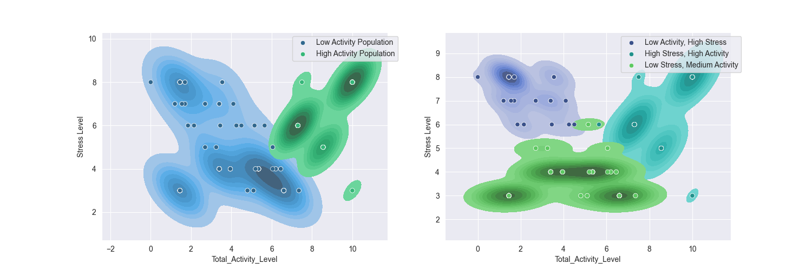

# Stress vs. Activity Analysis

This project explores the relationship between total activity levels and self-reported stress across different occupations. The goal was to identify whether higher activity is associated with increased stress and whether occupation plays a meaningful role in that relationship.

The analysis includes:

- Data cleaning and occupation-level filtering
- Exploratory data analysis (EDA)
- Correlation analysis
- K-means clustering to identify patterns in activity and stress

## Methodology:

In this project I created a combined metric called Total_Physical_Activity which combined the data from the Daily Steps an Physical Activity Column. This allowed me to create more readable charts and allowed be to quickly determine the corrilation between different samples within clusters.

## Experiments:

On looking at the intial Stres vs Physical Activity data I saw what looked like 2-3 distinct clusters in the raw data so I rand the kmeans algorithem on the data twice once for 2 clusters and once for three. I found that both cluster groups were potentially useful but the 2 cluster data was more stable over time so I think it's a more accurate description of the underling patterns. 

*Figure: K-means clustering reveals distinct population-level groups based on total activity and stress.*

## Findings

When looking closly at the two cluster data I found that the low activity population had a negitive corrilation between stress and activity levels while the high activity population had a positive corrilation. I hypothesised that this corrilation could have been linked to occupation but when I looked closer at the occupation data I found that the wasn't enough data in my dataset to get concrete conclusions from it. Even the individual occupations which showed a positive stress vs activity corrilation didn't show as strong a corrilation once I looked at the raw data. This was likely due to several occupations having insufficient sample sizes for detailed analasis.

These results suggest that the relationship between activity and stress is more evident at the aggregate level than within specific occupations. 

## Final Results

- Individuals with a below-average physical activity level could reduce stress by increasing their total activity levels.
- Individuals with above-average activity can reduce stress by lowering their activity levels.
- Based on this dataset, the ideal daily step count came out to be 7000.

We analyzed if the different correlations could be caused by a person's occupation but found there was not enough data in the dataset to get any conclusive information about that.

## Additional Observations

In the initial EDA for this notebook I found that the strongest corallation present was the coralation between sleep quality and stress levels. This shows that on an individual level the best way to lower a persons stress is to focus ensuring a stable sleep schuedule.

##### Tools:

Python, Pandas, Seaborn, Scikit-learn, Jupyter
