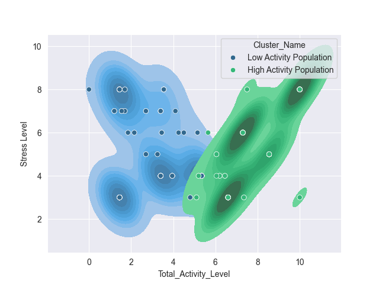

# Notebook Summary
## Stress vs. Activity Analysis

This project explores the relationship between total activity levels and self-reported stress across different occupations. The goal was to identify whether higher activity is associated with increased stress and whether occupation plays a meaningful role in that relationship.

The analysis includes:

- Data cleaning and occupation-level filtering
- Exploratory data analysis (EDA)
- Correlation analysis
- K-means clustering to identify patterns in activity and stress

Three distinct clusters were identified when analyzing the full dataset, suggesting meaningful population-level groupings. However, when the data were examined within individual occupations, these cluster patterns were not consistently reproduced. In several cases, apparent correlations appeared to be influenced by outliers rather than stable occupation-level trends.

*Figure: K-means clustering reveals three distinct population-level groups based on total activity and stress.*

These results suggest that the relationship between activity and stress is more evident at the aggregate level than within specific occupations. Several occupations were also excluded due to insufficient sample sizes, limiting subgroup analysis.

This project demonstrates exploratory analysis, clustering, and the importance of validating aggregate patterns at the subgroup level when working with real-world data.

## Final Observations

- Looking at the scatter plots of the two sets of occupations, it looks like the two occupations with a positive correlation between stress and total activity levels are likely caused by outliers.
- This indicates that although the 3 clusters I described early appear in aggregate, the hypothesis that they may be linked to occupation is not shown in this data.

## Actionable Observations

- Efforts to improve sleep duration and sleep quality have a huge effect on overall health.

Tools: Python, Pandas, Seaborn, Scikit-learn, Jupyter
